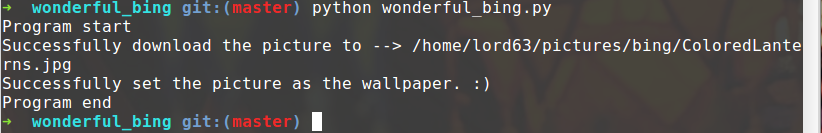
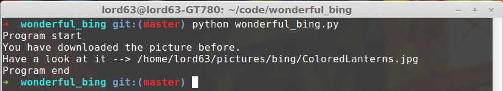

#**Wonderful_Bing**

#### My first python programme :)

### **Requirements**
* Python 2.7
* Requests
* Lxml

### **Snapshots**

first time you run it:

if the picture has been downloaded before:

if your pc doesn't connect to the network, it will try again after 5 mins.

and the notify should looks like this:

### **How to use**
1.  Edit the `picture_path` in the function `download_and_set`, choose a folder 
    that you want to save the picture in, end with a '/'.
2.  Add it to autostart, then every time you boot up your pc, this script will 
    automatically download the picture from Bing and set it as the wallpaper ;)

### **Note**
*  Only works under linux, maybe there will be a windows version someday or you 
   can edit it by youself. It works fine on my Linux Mint 16 Cinnamon.

### **License**
MIT License

